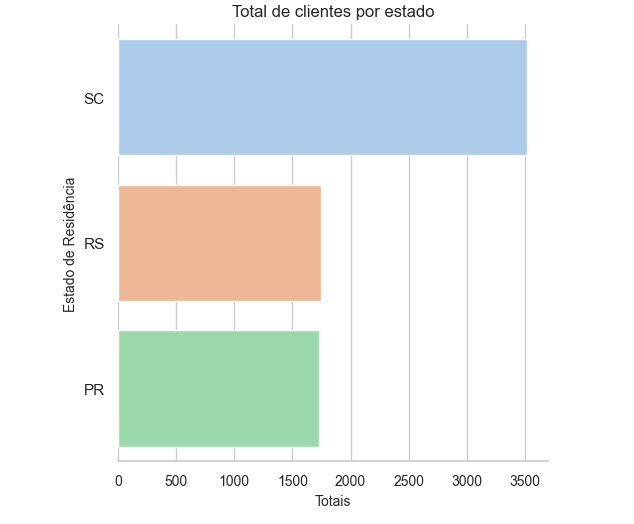

# Conhecendo melhor nossa base de consumidores: qual estado possui os clientes com melhores pontuações de crédito?




## Objetivo

Queremos conhecer melhor nossos clientes por estado. Para isso, iniciamos uma análise na pontuação de crédito. 
Para realizar a verificação inicial, precisamos de alguns valores.
Os valores são a média, a mediana, a moda e o desvio padrão da pontuação de crédito.

### Alguns dos métodos utilizados nessa análise
```
.agg
.groupby
.mode
.to_json
```


## Tópicos

Neste desafio você aprenderá:

- Média;
- Mediana;
- Moda;
- Desvio padrão.

